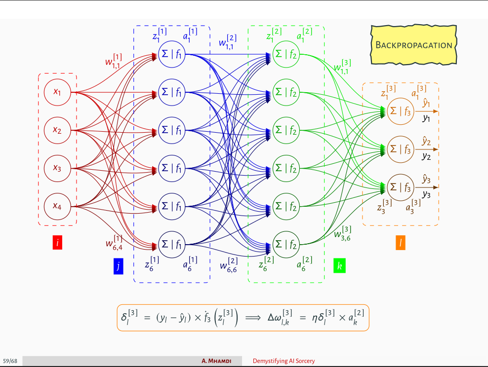

# Neural Network From Scratch In `Julia`
We build and train a neural network architecture in `Julia` without usage of deep learning frameworks. 

## Design of the architecture
The neural network (NN) is built from scratch and trained on some random data. The NN architecture is as follows:

```julia
model = [ # MLP
    Layer(num_features, num_neurons, relu; distribution='N'), 
    Layer(num_neurons, num_targets, softmax; distribution='N')
    ]
```
The choice of distribution for the weights initialization is either `N` for normal distribution or `U` for uniform distribution. Both `Xavier` and `He` initializations were implemented. The hyperparameters are defined as follows:
```julia
Settings(epochs, batch_size)
```

## Training the model

We can define a `struct` for the regularizer as follows:
```julia
Regularizer(method, λ, r, dropout)
```
`method` needs to be symbol or string of one of the following: `l1`, `l2`, `elasticnet`, or `none`. The `λ` parameter is the regularization parameter. The `r` parameter determines the mix of penalties in case of `elastcinet` method. The `dropout` parameter is the dropout rate. `loss` and `optimizer` are accessed through:
```julia
Solver(loss, optimizer, learning_rate, regularizer)
```
`loss` can be `:mae`, `:mse`, `:rmse`, `:binarycrossentropy` or `:crossentropy`. `:sgd` is the default optimizer.

The model is trained using the following method:
```julia
TrainNN(model, data_in, data_out, x_val, y_val; solver)
```
Under the hood, the `TrainNN` method calls the `FeedForward` and `BackProp` functions. The `FeedForward` method returns the pre-activations and the hypothesis of the model : `data_cache`. The method signature is as follows:
```julia
data_cache = FeedForward(model, data_in; solver::Solver)
```
The `BackProp` method allows to return the `loss` and the gradients of the weights and biases: `∇W` and `∇b`. The method signature is as follows:
```julia
loss, ∇W, ∇b = BackProp(model, data_cache, data_out; solver::Solver)
```

Detailed steps of the backpropagation algorithm are shown in the images below ([source](https://github.com/a-mhamdi/jlai/blob/main/Slides-Labs/Demystifying%20AI%20Sorcery%20(Part-1).pdf)).





The code is written in `Julia` and can be found in the `src` folder. The `main.jl` file contains the main code to train the neural network.

## Simulation results

The *loss* of the model after each epoch is shown in the figure below, for both the *training* and *test sets*.


*Confusion matrix*, *accuracy*, *precision*, *recall* and *f1 scores* are detailed as below.


**Note:** The code is not optimized for performance. It is written for educational purposes.

**TODO:** Implement the following features:
- [ ] parallelization of backprop on the batch of data instead of using a for loop;
- [ ] optimizers: `SGD+Momentum`, `SGD+Nesterov`, `Adam`, `RMSprop`, `Adagrad`, `Adadelta`.
