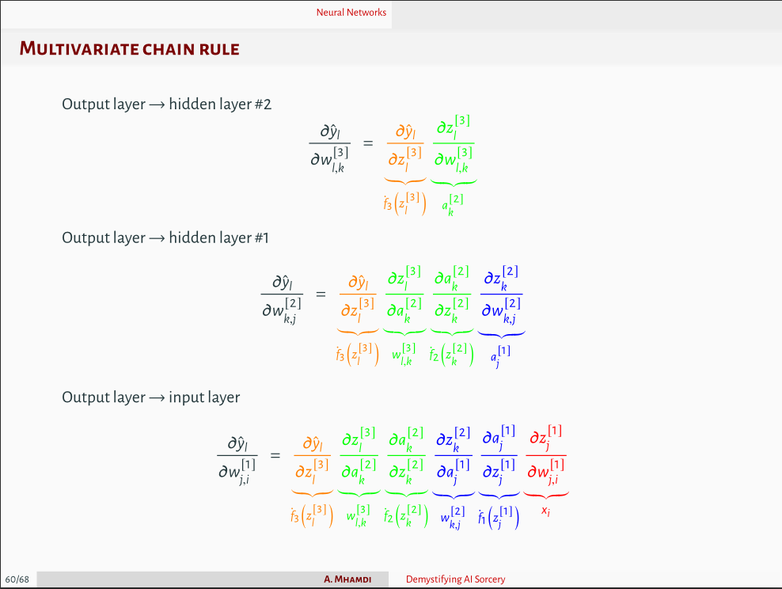

# Neural Network From Scratch In Julia
We build and train a neural network architecture in Julia without usage of deep learning frameworks.

The neural network (NN) is built from scratch and trained on some random data. The NN architecture is as follows:

```julia
model = [ # MLP
    Layer(num_features, num_neurons, relu; distribution='N'), 
    Layer(num_neurons, num_targets, relu; distribution='N')
    ]
```
The choice of distribution for the weights initialization is either `N` for normal distribution or `U` for uniform distribution. Both `Xavier` and `He` initializations were implemented.

The hyperparameters are defined as follows:
```julia
Settings(epochs, learning_rate, batch_size)
```
We can define a struct for the regularizer as follows:
```julia
Regularizer(method, λ, r, dropout)
```
`method` needs to be symbol of one of the following: `L1`, `L2`, `ElasticNet`, or `None`. The `λ` parameter is the regularization parameter. The `r` parameter determines the mix of penalties in case of `ElastciNet` method. The `dropout` parameter is the dropout rate.

The model is trained using the `FeedForward` and `BackProp` methods. The `FeedForward` method returns the pre-activations `A` and the hypothesis of the model `H`. The method signature is as follows:
```julia
A, H = FeedForward(model, data_in)
```
The `BackProp` method allows to return the `loss` and the gradients of the weights and biases: `∇W` and `∇b`. The method signature is as follows:
```julia
loss, ∇W, ∇b = BackProp(model, A, H, data_in, data_out, regularizer)
```
Detailed steps of the backpropagation algorithm are shown in the images below ([source](https://github.com/a-mhamdi/jlai/blob/main/Slides-Labs/Demystifying%20AI%20Sorcery%20(Part-1).pdf)).




The code is written in `Julia` and can be found in the `src` folder. The `main.jl` file contains the main code to train the neural network.

**Note:** The code is not optimized for performance. It is written for educational purposes.

**TODO:** Implement the following features:
- [ ] parallelization of backprop on the batch of data instead of using a for loop;
- [ ] the `Dropout` regularization technique;
- [ ] optimizers: `SGD+Momentum`, `SGD+Nesterov`, `Adam`, `RMSprop`, `Adagrad`, `Adadelta`.
