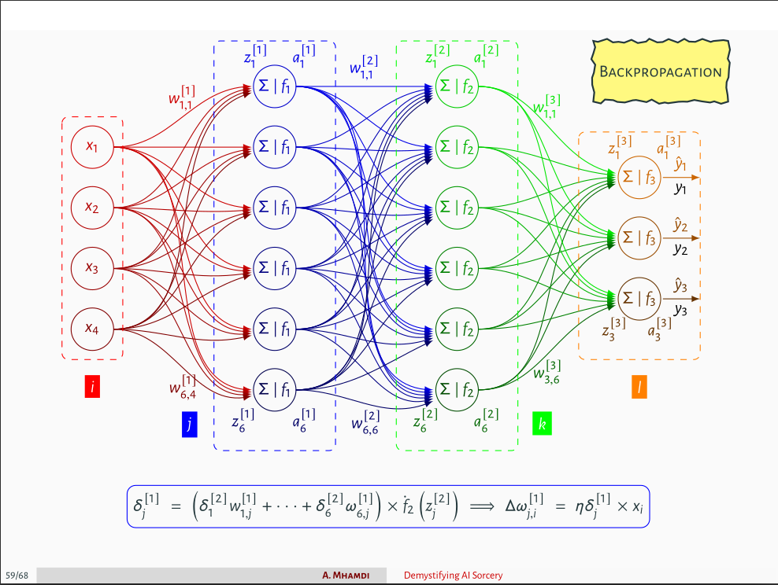

# Neural Network From Scratch In Julia
We build and train a neural network architecture in Julia without usage of deep learning frameworks.

Detailed steps of the backpropagation algorithm are shown in the images below ([source](https://github.com/a-mhamdi/jlai/blob/main/Slides-Labs/Demystifying%20AI%20Sorcery%20(Part-1).pdf)).

The code is written in Julia and can be found in the `src` folder. The `main.jl` file contains the main code to train the neural network.

**TODO:** Implement the following features:
- [x] Implement different activation functions: `ReLU`, `LeakyReLU`, `Sigmoid`, `Tanh`, `Softmax`
- [ ] Split data into training and testing sets
- [ ] Implement a validation set
- [ ] Implement a mini-batch gradient descent
- [ ] Implement optimizers: `SGD+Momentum`, `SGD+Nesterov`, `Adam`, `RMSprop`, `Adagrad`, `Adadelta`
